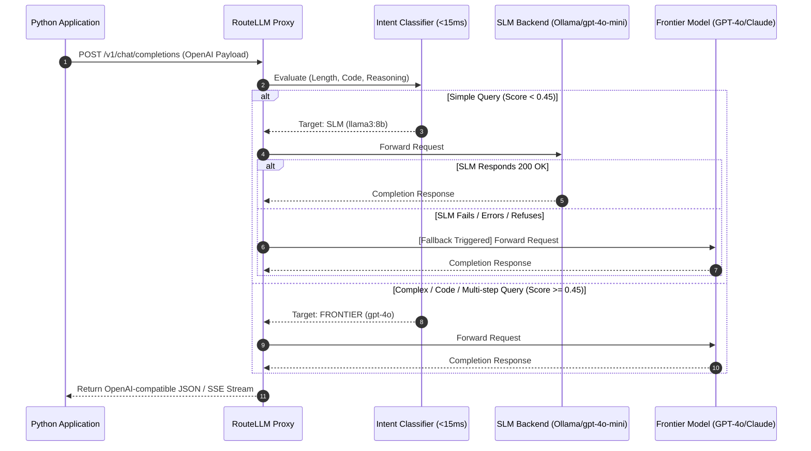

# RouteLLM 🚀

[](https://opensource.org/licenses/MIT)
[](https://www.python.org/downloads/)
[](https://fastapi.tiangolo.com)
[](https://platform.openai.com/docs/api-reference)

> **Production-grade, Zero-Dependency-Bloat Smart LLM Router & Fallback Proxy**

`RouteLLM` is an ultra-fast (<15ms decision latency), asynchronous local proxy fully compatible with the **OpenAI API specification**. It intercepts inbound LLM requests from Python applications, evaluates prompt complexity locally using sub-millisecond heuristics, routes cheap/simple queries to Small Language Models (SLMs or local models via Ollama/vLLM), and escalates complex queries or fallback errors to Tier-1 Frontier models (OpenAI, Anthropic).

---

## 🌟 Key Features

- **⚡ Sub-15ms Local Classifier:** Zero API network latency incurred to decide model routing. Uses length heuristics, pre-compiled token regex patterns, and tool-call indicators.
- **🔌 100% OpenAI Specification Compatible:** Drop-in replacement for existing Python OpenAI SDK applications. Just swap `base_url` and `api_key`.
- **🛡️ Automatic Transparent Fallback:** If an SLM returns a JSON parse error, model refusal, or connection failure, RouteLLM transparently retries and escalates to the Frontier model without failing the client request.
- **🌊 Streaming (SSE) & Non-Streaming Support:** Full support for `stream=True` chunk passthrough.
- **📊 Real-Time Observability & Cost Metrics:** `/metrics` endpoint calculating USD cost saved in real time based on input/output token counts.

---

## 🏗️ Architecture Flowchart



---

## 📈 Cost-Savings Benchmark Matrix

By offloading simple conversational, classification, and formatting tasks to SLMs while reserving Frontier models for technical code generation and deep reasoning, `RouteLLM` dramatically reduces API bills:

| Query Type | Typical Ratio | Route Target | Baseline Cost (1M Tokens) | RouteLLM Cost (1M Tokens) | Savings % |
| :--- | :---: | :---: | :---: | :---: | :---: |
| **Short Q&A / Summarization** | 60% | Local SLM / `llama3:8b` | $6.25 (Frontier) | $0.00 - $0.37 (SLM) | **~94%** |
| **Classification / Extract** | 25% | `gpt-4o-mini` | $6.25 (Frontier) | $0.37 (SLM) | **~94%** |
| **Complex Code / Math Proof** | 15% | `gpt-4o` / `claude-3-5` | $6.25 (Frontier) | $6.25 (Frontier) | **0%** |
| **Blended Workload Total** | **100%** | **Smart Routed** | **$6.25** | **$1.25** | **🔥 80% SAVINGS** |

---

## 🛠️ Installation & Setup

### Requirements
- **Python 3.12+**
- **Pip / Hatch / uv**

### Installation

```bash
git clone https://github.com/qmmughal/routellm.git
cd routellm
pip install -e .
```

Or install dependencies directly:
```bash
pip install fastapi uvicorn httpx pydantic pydantic-settings tiktoken
```

---

## ⚙️ Configuration Reference

Configure `RouteLLM` via environment variables (or `.env` file) prefixed with `ROUTELLM_`:

| Environment Variable | Default Value | Description |
| :--- | :--- | :--- |
| `ROUTELLM_HOST` | `0.0.0.0` | Host address for RouteLLM proxy |
| `ROUTELLM_PORT` | `8000` | Port for RouteLLM proxy |
| `ROUTELLM_SLM_BASE_URL` | `http://localhost:11434/v1` | Base URL for SLM provider (e.g. Ollama) |
| `ROUTELLM_SLM_MODEL_NAME` | `llama3:8b` | Default SLM model name |
| `ROUTELLM_FRONTIER_BASE_URL` | `https://api.openai.com/v1` | Base URL for Frontier model provider |
| `ROUTELLM_FRONTIER_MODEL_NAME` | `gpt-4o` | Default Frontier model name |
| `ROUTELLM_FRONTIER_API_KEY` | `""` | API Key for Frontier provider |
| `ROUTELLM_MAX_SLM_TOKENS` | `450` | Maximum token threshold before escalating to Frontier |
| `ROUTELLM_AUTO_FALLBACK_ENABLED` | `True` | Automatically retry on Frontier if SLM fails |

---

## 🚀 Quickstart

### 1. Launch Proxy Server

```bash
# Start proxy with default settings
python -m routellm.main

# Or via CLI script
routellm --port 8000
```

### 2. Connect via OpenAI Python SDK

```python
from openai import OpenAI

# Simply set base_url to RouteLLM proxy endpoint!
client = OpenAI(
    base_url="http://localhost:8000/v1",
    api_key="sk-routellm-local"
)

# Simple query -> Automatically routed to local SLM
response = client.chat.completions.create(
    model="gpt-4o-mini",
    messages=[{"role": "user", "content": "What is the capital of France?"}]
)
print("Response:", response.choices[0].message.content)

# Technical query -> Automatically escalated to Frontier model (GPT-4o)
response = client.chat.completions.create(
    model="gpt-4o",
    messages=[{"role": "user", "content": "Write a high-performance concurrent queue in Rust with tests."}]
)
print("Response:", response.choices[0].message.content)
```

---

## 📊 Endpoints & Observability

- **`POST /v1/chat/completions`**: OpenAI compatible completions interface.
- **`GET /health`**: Health status and backend endpoints status.
- **`GET /metrics`**: System metrics and cost savings breakdown:

```json
{
  "metrics": {
    "uptime_seconds": 124.5,
    "total_requests": 42,
    "slm_routed_count": 34,
    "frontier_routed_count": 8,
    "fallback_escalations_count": 1,
    "total_tokens": 18450,
    "total_cost_saved_usd": 0.114250,
    "avg_decision_latency_ms": 1.42,
    "avg_total_latency_ms": 482.10
  }
}
```

---

## 📄 License

Distributed under the MIT License.
